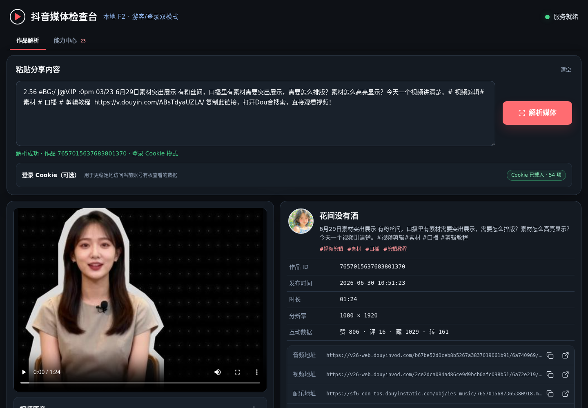
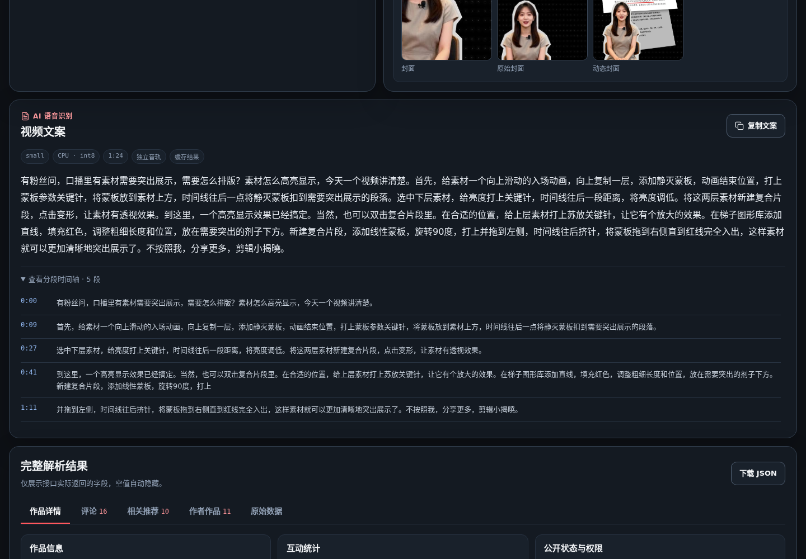
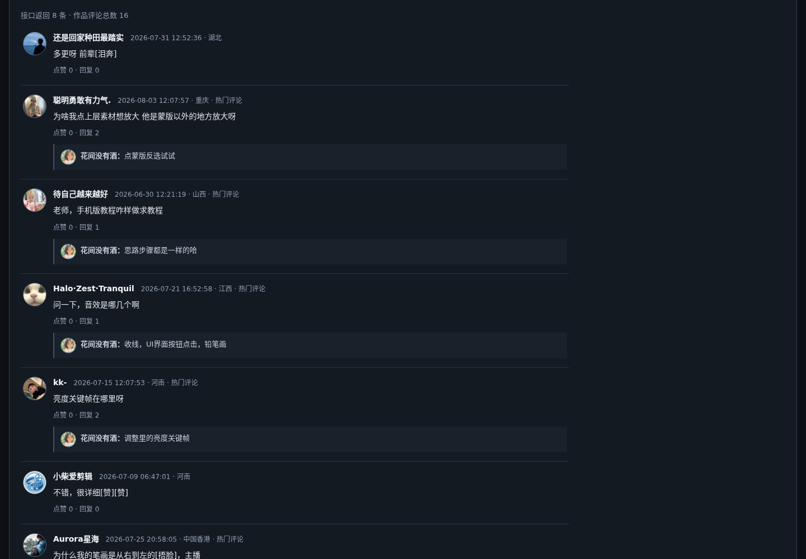
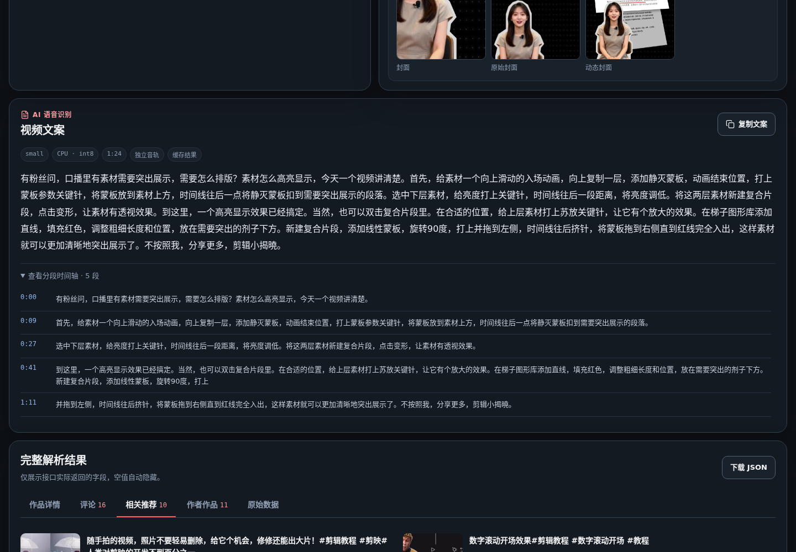
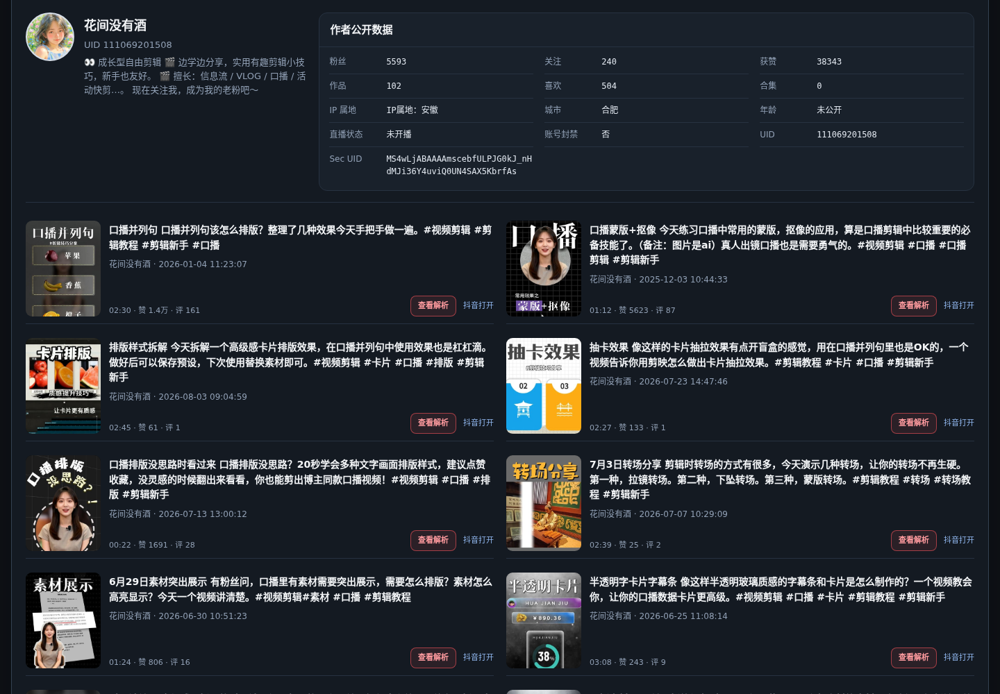
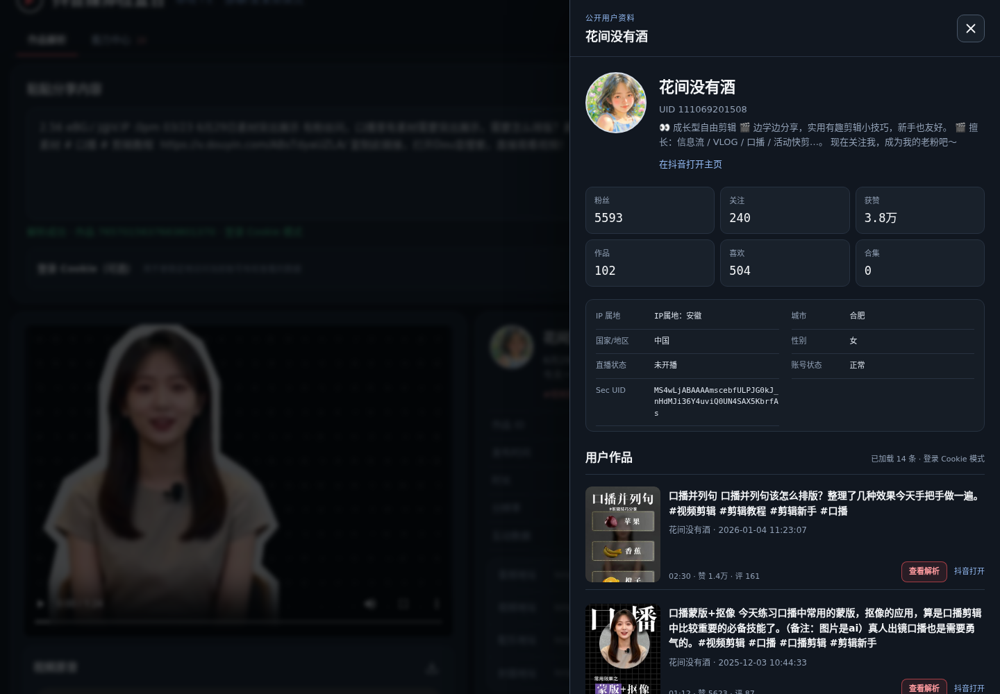
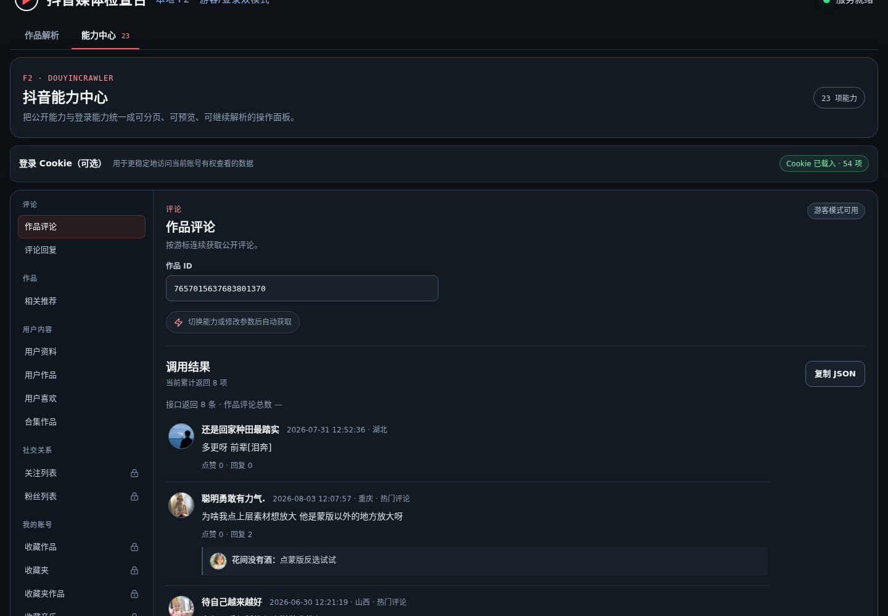
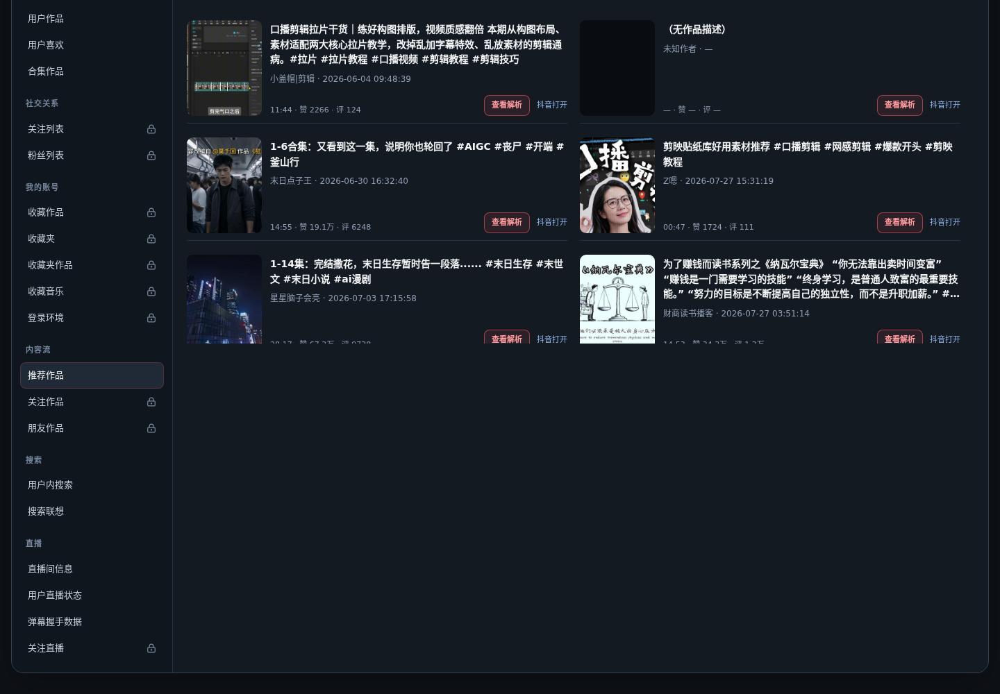

# 抖音媒体检查台

一个基于 **F2、FastAPI、React 和 faster-whisper** 的本地抖音内容分析工作台。粘贴分享文案或作品链接，即可完成媒体解析、文案识别和关联内容浏览。

## 90 秒能力演示

  <a href="docs/assets/demo/douyin-capabilities.webm">▶ 点击观看完整演示视频</a>

## 能做什么

- **作品解析**：识别分享文案、短链接、作品链接和作品 ID，展示标题、作者、互动数据、媒体参数及原始数据。
- **媒体查看**：在线播放视频、原音和配乐，预览封面、动态封面及图集，并提供媒体地址。
- **AI 视频文案**：自动提取音轨并生成中文文案、自然标点和分段时间轴；结果可复制、可缓存。
- **内容浏览**：查看评论与回复、相关推荐、作者资料和近期作品，并可继续解析任意关联作品。
- **23 项 F2 能力**：覆盖作品、用户、账号、Feed、搜索和直播；支持自动请求、分页加载与前端缓存。
- **游客 / 登录双模式**：公开内容可直接使用，需要账号权限的能力会明确标识。

## 功能截图

<table>
  <tr>
    <td width="50%"> AI 视频文案与分段时间轴</td>
    <td width="50%"> 评论、回复与用户入口</td>
  </tr>
  <tr>
    <td> 相关推荐与连续解析</td>
    <td> 作者公开数据与作品列表</td>
  </tr>
  <tr>
    <td> 用户资料与作品抽屉</td>
    <td> 23 项 F2 能力中心</td>
  </tr>
  <tr>
    <td colspan="2"> 推荐 Feed、自动分页与作品联动</td>
  </tr>
</table>

## 技术栈

`React + TypeScript + Vite` 前端，`FastAPI + F2` 数据服务，`faster-whisper` 本地语音识别。

## 能力边界

- 数据可用性受作品权限、账号权限、地区限制和抖音上游接口变化影响。
- 登录 Cookie 只用于访问当前账号本身有权查看的内容，页面不会回显 Cookie 明文。
- 项目不会绕过平台权限；使用和保存平台内容时请遵守相关规则与法律。

项目采用 [Apache License 2.0](LICENSE)。
