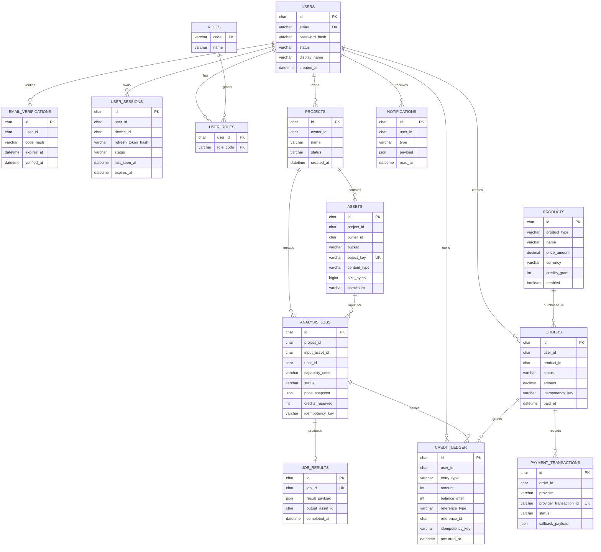

# MySQL 数据模型与迁移规范

## 1. 目标

本文件定义第一阶段的关系型数据边界、核心表、状态机和迁移规则。第一阶段可运行在一个 MySQL 实例中，但必须通过独立数据库、独立账号和代码模块维持边界。

```text
user_db       用户、邮箱验证、角色、登录设备和会话
project_db    项目、资产、AI 任务和结果索引
billing_db    商品、订单、支付交易、积分账本、可选订阅
platform_db   通知（后续可拆分）
```

**禁止跨数据库外键。** 服务间只保存对方的 ID（如 `user_id`、`project_id`），由 API 或事件保证一致性。

## 2. ERD



## 3. 表设计要点

### 3.1 `users` 与邮箱验证

| 字段 | 规则 |
| --- | --- |
| `email` | 小写归一化后唯一；只支持邮箱登录 |
| `password_hash` | Argon2id 结果；不保存明文密码 |
| `status` | `PENDING`、`ACTIVE`、`SUSPENDED`、`DELETED` |
| `email_verified_at` | 验证成功后写入 |

`email_verifications` 只保存验证码哈希、用途和过期时间。验证码验证成功、过期或达到尝试次数后不得再次使用。

### 3.2 `user_sessions`

每个设备一条记录。`refresh_token` 仅保存哈希，真实 token 仅通过 HttpOnly Secure Cookie 留在浏览器。

| 字段 | 规则 |
| --- | --- |
| `device_id` | 客户端生成并持久化；同一用户下唯一 |
| `status` | `ACTIVE`、`REVOKED`、`EXPIRED` |
| `last_seen_at` | 每次刷新或业务请求按节流更新 |
| `expires_at` | 默认 30 天；刷新 token 轮换时延长 |

索引：`(user_id, status, last_seen_at)`。创建新会话时，在同一事务内按 `AUTH_MAX_ACTIVE_SESSIONS` 撤销最早活跃会话。

### 3.3 `projects`、`assets`、`analysis_jobs`

`assets` 仅保存 MinIO 元数据，不保存文件本体。对象键应唯一，推荐格式：

```text
{environment}/user/{user_id}/project/{project_id}/{asset_id}/{filename}
```

`analysis_jobs` 是任务的事实来源，最终状态不依赖进程内缓存。

| 字段 | 说明 |
| --- | --- |
| `capability_code` | 如 `media.transcription`、`media.shot_detection` |
| `status` | `CREATING`、`PENDING`、`RUNNING`、`SUCCESS`、`FAILED`、`CANCELED`、`REVIEW_REQUIRED` |
| `price_snapshot` | 创建任务时锁定的计价规则、输入测量、报价与版本 |
| `credits_reserved` | 创建时预扣的积分 |
| `idempotency_key` | 用户与创建接口范围内唯一 |

唯一索引：`(user_id, idempotency_key)`。任务状态更新使用乐观版本号或条件更新，避免并发请求重复处理。

### 3.4 `products`、`orders` 与 `payment_transactions`

第一阶段 `products.product_type` 以 `CREDIT_PACK` 为主；`SUBSCRIPTION` 是可选扩展。

`orders.status`：`PENDING`、`PAYING`、`PAID`、`CLOSED`、`REFUNDED`、`FAILED`。

| 约束 | 原因 |
| --- | --- |
| `(user_id, idempotency_key)` 唯一 | 防止重复创建订单 |
| `provider_transaction_id` 唯一 | 防止重复支付回调发放积分 |
| `amount` 在订单创建时锁定 | 回调时必须与支付渠道实收金额核对 |
| `callback_payload` 脱敏保存 | 用于审计；签名/敏感字段不落日志 |

### 3.5 不可变 `credit_ledger`

积分余额不能只依赖可修改字段。`credit_ledger` 是不可变审计记录：插入新行，不更新或删除历史行。

| `entry_type` | `amount` | 说明 |
| --- | --- | --- |
| `CREDIT_GRANT` | 正数 | 积分商品购买、活动、管理员补偿 |
| `CREDIT_RESERVE` | 负数 | 创建任务时预扣 |
| `CREDIT_SETTLE` | 0 或负数差额 | 确认实际消耗；按最终计价策略实现 |
| `CREDIT_REFUND` | 正数 | 系统/供应商失败、差额退款、管理员补偿 |
| `CREDIT_EXPIRE` | 负数 | 仅在某类积分配置到期时使用 |

建议维护 `credit_balance_snapshots` 作为查询加速，但账本是唯一审计来源。每次任务创建应在同一事务完成：

```text
INSERT analysis_jobs (PENDING)
INSERT credit_ledger (CREDIT_RESERVE)
COMMIT
```

用户在 `PENDING` 阶段主动取消时只更新任务为 `CANCELED`，默认不插入退款账本；系统/供应商失败且没有可用结果时插入 `CREDIT_REFUND`。

### 3.6 可靠事件表

| 表 | 用途 |
| --- | --- |
| `notifications` | 用户可查询的站内通知，不作为任务状态的唯一来源 |

## 4. 状态机和更新约束

```text
Job:
CREATING → PENDING → RUNNING → SUCCESS
                              ↘ FAILED
PENDING → CANCELED
RUNNING → REVIEW_REQUIRED → SUCCESS / FAILED

Order:
PENDING → PAYING → PAID
                 ↘ CLOSED / FAILED
PAID → REFUNDED
```

- 只能通过条件更新推进状态，例：`UPDATE ... WHERE id = ? AND status = 'PENDING'`。
- 不能从 `SUCCESS` 回退为 `RUNNING`；不能从 `PAID` 回退为 `PENDING`。
- 所有状态变化记录 `updated_at`、`updated_by` 或来源事件 ID。

## 5. Alembic 迁移规范

1. 每项 schema 变化必须添加新的 migration；禁止手工修改生产库。
2. Migration 文件以业务意图命名，例如 `20260821_create_user_sessions.py`。
3. 大表新增索引、字段或数据回填应拆为可回滚、小批次操作。
4. 应用版本必须兼容迁移前后至少一个版本，避免发布时 API 与表结构不一致。
5. 上线前在空库和脱敏备份库分别执行 `upgrade head` 与回滚演练。
