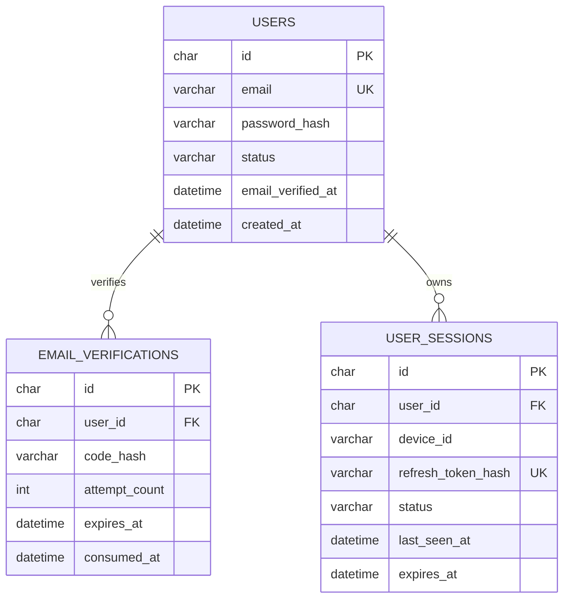

# 用户体系数据库表结构（MVP）

## 1. 范围

本设计只覆盖以下能力：

- 邮箱注册、邮箱验证码验证和账号启用；
- 邮箱密码登录；
- Access Token + Refresh Token；
- 多设备会话查看、单设备退出、全部退出和超限踢出最早设备。

本期只需要 3 张 MySQL 表：`users`、`email_verifications`、`user_sessions`。这不代表认证数据只使用 MySQL：MySQL 保存可恢复的账号与会话事实，Redis 负责短期认证缓存、立即撤销和限流；MinIO 不参与登录。角色权限、密码找回、通知、积分、订单和项目相关表都不在本期创建。

## 2. 关系图



## 3. 统一约定

| 项目 | 约定 |
| --- | --- |
| 数据库 | `user_db`，MySQL 8.4，InnoDB，`utf8mb4` |
| 主键 | 应用层生成 UUID，使用 `CHAR(36)` 保存；不使用自增 ID |
| 时间 | `DATETIME(3)`，统一存 UTC；由应用层转换展示时区 |
| 邮箱 | 入库前 `trim + lowercase`，`users.email` 全局唯一 |
| 密码 | 仅保存 Argon2id 哈希；不保存、记录或返回明文密码 |
| Refresh Token | 仅保存经服务端密钥 HMAC-SHA-256 后的哈希；原始 Token 只写入 `HttpOnly + Secure + SameSite` Cookie |
| Redis | 只缓存会话状态、撤销标记和限流计数；不保存密码、验证码原文或 Refresh Token 原文 |
| MinIO | 不存储用户账号或登录凭证；仅在用户通过 API 鉴权后，由后端签发短期对象访问 URL |
| 删除 | MVP 采用状态禁用/软删除思路；不直接物理删除用户 |

## 4. `users`：用户账号

一行代表一个邮箱账号。注册时创建为 `PENDING`，邮箱验证成功后改为 `ACTIVE`。

| 字段 | 类型 | 空 | 默认值 | 说明 |
| --- | --- | --- | --- | --- |
| `id` | `CHAR(36)` | 否 | — | 主键，UUID |
| `email` | `VARCHAR(254)` | 否 | — | 规范化后邮箱，唯一 |
| `password_hash` | `VARCHAR(255)` | 否 | — | Argon2id 哈希 |
| `display_name` | `VARCHAR(80)` | 是 | `NULL` | 用户显示名 |
| `status` | `VARCHAR(16)` | 否 | `PENDING` | `PENDING` / `ACTIVE` / `SUSPENDED` / `DELETED` |
| `email_verified_at` | `DATETIME(3)` | 是 | `NULL` | 邮箱验证完成时间 |
| `last_login_at` | `DATETIME(3)` | 是 | `NULL` | 最近成功登录时间 |
| `created_at` | `DATETIME(3)` | 否 | 当前时间 | 创建时间 |
| `updated_at` | `DATETIME(3)` | 否 | 当前时间 | 最近修改时间 |
| `deleted_at` | `DATETIME(3)` | 是 | `NULL` | 软删除时间 |

约束：`ACTIVE` 用户必须已有 `email_verified_at`；该规则由应用层在状态转换时保证。

## 5. `email_verifications`：邮箱验证码

一行代表一次注册验证码。验证码只能使用一次；重新发送时应使该用户此前未使用的验证码失效。

| 字段 | 类型 | 空 | 默认值 | 说明 |
| --- | --- | --- | --- | --- |
| `id` | `CHAR(36)` | 否 | — | 主键，UUID |
| `user_id` | `CHAR(36)` | 否 | — | 外键，关联 `users.id` |
| `code_hash` | `CHAR(64)` | 否 | — | 验证码的 HMAC-SHA-256 哈希，不保存原码 |
| `attempt_count` | `TINYINT UNSIGNED` | 否 | `0` | 已失败验证次数 |
| `max_attempts` | `TINYINT UNSIGNED` | 否 | `5` | 最大尝试次数 |
| `expires_at` | `DATETIME(3)` | 否 | — | 过期时间，建议发送后 10 分钟 |
| `consumed_at` | `DATETIME(3)` | 是 | `NULL` | 验证成功使用时间 |
| `invalidated_at` | `DATETIME(3)` | 是 | `NULL` | 重发验证码或人工失效时间 |
| `created_at` | `DATETIME(3)` | 否 | 当前时间 | 发送记录创建时间 |

有效验证码条件：`consumed_at IS NULL`、`invalidated_at IS NULL`、`expires_at > NOW(3)` 且 `attempt_count < max_attempts`。

## 6. `user_sessions`：设备会话与 Refresh Token

每台设备/浏览器保留一条活动会话。刷新 Token 轮换时更新同一行的 `refresh_token_hash`；退出、封禁、改密或发现 Token 重放时撤销对应会话或全部会话。

这张表保存的不是明文登录凭证：`password_hash` 位于 `users`，本表只保存 Refresh Token 的不可逆哈希与会话状态。即使数据库泄露，攻击者也不能直接使用这些值登录。

| 字段 | 类型 | 空 | 默认值 | 说明 |
| --- | --- | --- | --- | --- |
| `id` | `CHAR(36)` | 否 | — | 主键，也是 JWT 的 `sid` |
| `user_id` | `CHAR(36)` | 否 | — | 外键，关联 `users.id` |
| `device_id` | `VARCHAR(128)` | 否 | — | 客户端生成并持久化的设备标识 |
| `device_name` | `VARCHAR(128)` | 是 | `NULL` | 例如“Chrome on macOS” |
| `user_agent` | `VARCHAR(512)` | 是 | `NULL` | 用于设备列表展示和风控，不作授权依据 |
| `ip_hash` | `CHAR(64)` | 是 | `NULL` | IP 经 HMAC 后的哈希，不存原始 IP |
| `refresh_token_hash` | `CHAR(64)` | 否 | — | 当前有效 Refresh Token 的哈希，唯一 |
| `status` | `VARCHAR(16)` | 否 | `ACTIVE` | `ACTIVE` / `REVOKED` / `EXPIRED` |
| `last_seen_at` | `DATETIME(3)` | 否 | 当前时间 | 最近使用时间，用于超限踢出最早会话 |
| `expires_at` | `DATETIME(3)` | 否 | — | Refresh Token 最终过期时间，建议 30 天 |
| `revoked_at` | `DATETIME(3)` | 是 | `NULL` | 撤销时间 |
| `revoke_reason` | `VARCHAR(32)` | 是 | `NULL` | `LOGOUT` / `LOGOUT_ALL` / `DEVICE_LIMIT` / `PASSWORD_CHANGED` / `SECURITY` |
| `created_at` | `DATETIME(3)` | 否 | 当前时间 | 会话创建时间 |
| `updated_at` | `DATETIME(3)` | 否 | 当前时间 | 最近修改时间 |

## 7. MySQL 8.4 DDL

```sql
CREATE DATABASE IF NOT EXISTS user_db
  CHARACTER SET utf8mb4
  COLLATE utf8mb4_0900_ai_ci;

USE user_db;

CREATE TABLE users (
  id CHAR(36) NOT NULL,
  email VARCHAR(254) NOT NULL,
  password_hash VARCHAR(255) NOT NULL,
  display_name VARCHAR(80) NULL,
  status VARCHAR(16) NOT NULL DEFAULT 'PENDING',
  email_verified_at DATETIME(3) NULL,
  last_login_at DATETIME(3) NULL,
  created_at DATETIME(3) NOT NULL DEFAULT CURRENT_TIMESTAMP(3),
  updated_at DATETIME(3) NOT NULL DEFAULT CURRENT_TIMESTAMP(3) ON UPDATE CURRENT_TIMESTAMP(3),
  deleted_at DATETIME(3) NULL,
  PRIMARY KEY (id),
  UNIQUE KEY uq_users_email (email),
  CONSTRAINT chk_users_status CHECK (status IN ('PENDING', 'ACTIVE', 'SUSPENDED', 'DELETED'))
) ENGINE=InnoDB;

CREATE TABLE email_verifications (
  id CHAR(36) NOT NULL,
  user_id CHAR(36) NOT NULL,
  code_hash CHAR(64) NOT NULL,
  attempt_count TINYINT UNSIGNED NOT NULL DEFAULT 0,
  max_attempts TINYINT UNSIGNED NOT NULL DEFAULT 5,
  expires_at DATETIME(3) NOT NULL,
  consumed_at DATETIME(3) NULL,
  invalidated_at DATETIME(3) NULL,
  created_at DATETIME(3) NOT NULL DEFAULT CURRENT_TIMESTAMP(3),
  PRIMARY KEY (id),
  KEY idx_email_verifications_active (user_id, expires_at),
  CONSTRAINT fk_email_verifications_user
    FOREIGN KEY (user_id) REFERENCES users(id) ON DELETE CASCADE,
  CONSTRAINT chk_email_verification_attempts CHECK (attempt_count <= max_attempts)
) ENGINE=InnoDB;

CREATE TABLE user_sessions (
  id CHAR(36) NOT NULL,
  user_id CHAR(36) NOT NULL,
  device_id VARCHAR(128) NOT NULL,
  device_name VARCHAR(128) NULL,
  user_agent VARCHAR(512) NULL,
  ip_hash CHAR(64) NULL,
  refresh_token_hash CHAR(64) NOT NULL,
  status VARCHAR(16) NOT NULL DEFAULT 'ACTIVE',
  last_seen_at DATETIME(3) NOT NULL DEFAULT CURRENT_TIMESTAMP(3),
  expires_at DATETIME(3) NOT NULL,
  revoked_at DATETIME(3) NULL,
  revoke_reason VARCHAR(32) NULL,
  created_at DATETIME(3) NOT NULL DEFAULT CURRENT_TIMESTAMP(3),
  updated_at DATETIME(3) NOT NULL DEFAULT CURRENT_TIMESTAMP(3) ON UPDATE CURRENT_TIMESTAMP(3),
  PRIMARY KEY (id),
  UNIQUE KEY uq_user_sessions_refresh_token_hash (refresh_token_hash),
  UNIQUE KEY uq_user_sessions_user_device (user_id, device_id),
  KEY idx_user_sessions_active_devices (user_id, status, last_seen_at),
  CONSTRAINT fk_user_sessions_user
    FOREIGN KEY (user_id) REFERENCES users(id) ON DELETE CASCADE,
  CONSTRAINT chk_user_sessions_status CHECK (status IN ('ACTIVE', 'REVOKED', 'EXPIRED'))
) ENGINE=InnoDB;
```

## 8. Redis 与 MinIO 的职责

### 8.1 Redis：加速认证，不替代 MySQL

| Key | 内容 | TTL | 写入时机 |
| --- | --- | --- | --- |
| `auth:session:{session_id}` | `user_id`、会话状态、过期时间等无敏感摘要 | 不超过该会话 `expires_at` | 登录、刷新 Token、会话状态变更 |
| `auth:revoked:{session_id}` | `1` | 到该会话或 Access Token 最晚过期时间 | 退出、改密、封禁、超限踢出时 |
| `rate:login:{email_hash}` | 登录次数计数 | 例如 10 分钟 | 登录失败或频繁请求时 |
| `rate:verify:{email_hash}` | 验证码尝试/发送计数 | 例如 10 分钟 | 发送或验证邮箱验证码时 |

认证流程：Access Token 含 `user_id` 与 `session_id`；每次需要立即生效的鉴权检查先查 `auth:revoked:{session_id}`。缓存未命中或 Redis 不可用时，回退查询 `user_sessions`。因此 Redis 被清空只会造成缓存回源，不会让用户数据或会话事实丢失。

### 8.2 MinIO：只处理已鉴权用户的文件

MinIO 不保存用户密码、Session 或 Token。后端使用自己的 MinIO 服务账号访问对象存储；用户请求上传或下载时，API 先依据 MySQL 中的用户和资源归属完成鉴权，再签发短期预签名 URL。用户只能拿到对象访问权限，不能拿到 MinIO 服务账号。

## 9. 必须由应用层保证的事务规则

### 注册与邮箱验证

1. 注册：创建 `users(status='PENDING')`，再创建 `email_verifications`。
2. 重发：使该用户未消费的验证码写入 `invalidated_at`，再创建一条新验证码。
3. 验证成功：在同一事务中写入 `email_verifications.consumed_at`、`users.email_verified_at`，并将用户改为 `ACTIVE`。

### 登录与会话上限

1. 只允许 `users.status = 'ACTIVE'` 的用户登录。
2. 新建会话前，用 `SELECT ... FOR UPDATE` 锁定该用户的活动会话；若数量达到 `AUTH_MAX_ACTIVE_SESSIONS`（默认 5），撤销 `last_seen_at` 最早的一条。
3. Refresh Token 刷新时，验证哈希、检查会话状态与过期时间，然后原子更新新的 `refresh_token_hash` 和 `last_seen_at`。
4. 修改密码、退出全部设备或账户封禁时，批量把活动会话标记为 `REVOKED`。

## 10. 这期不创建的表

| 表 | 何时再加 |
| --- | --- |
| `roles`、`user_roles` | 需要后台管理员与 RBAC 时 |
| `password_reset_tokens` | 增加“忘记密码”功能时 |
| `user_identities` | 接入微信、GitHub、Google 等第三方登录时 |
| `auth_audit_logs` | 有合规审计或风控需求时 |
