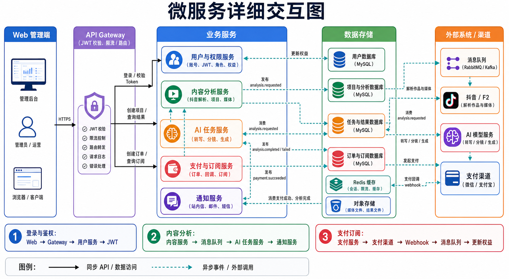
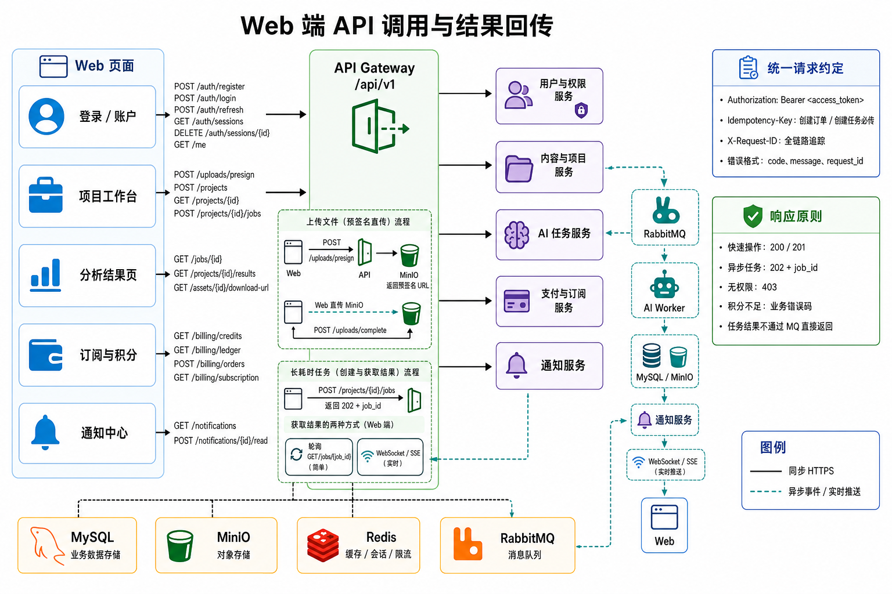
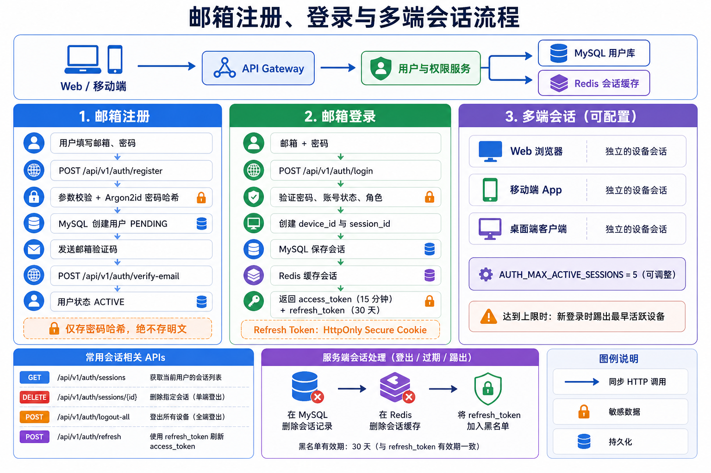
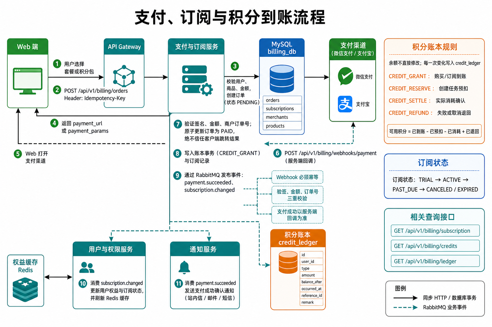
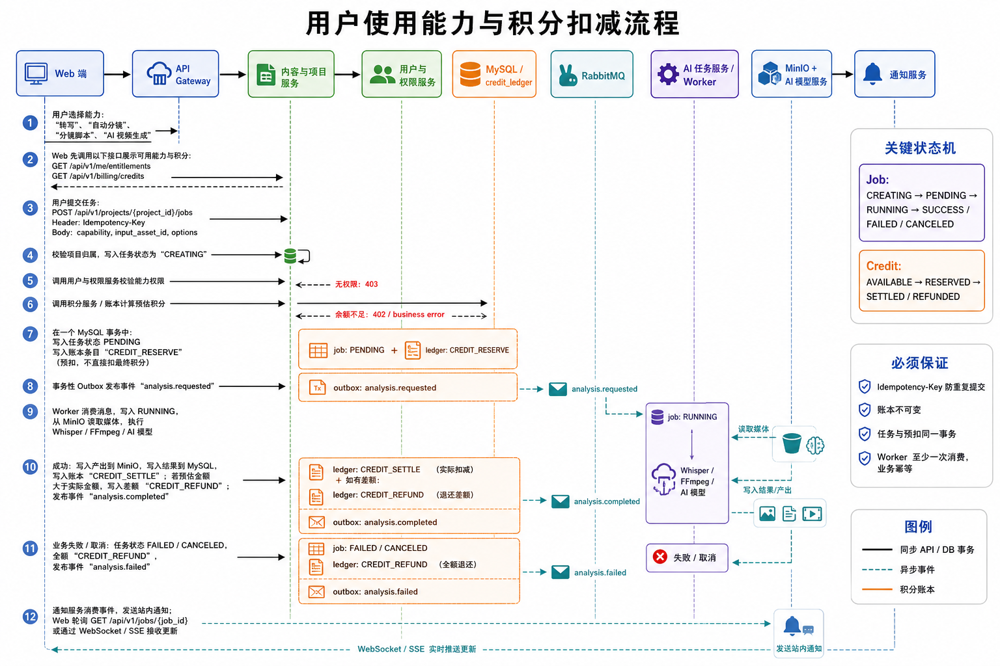

# 用户、支付、积分与能力调用设计

> 本文定义用户从邮箱注册、登录、购买积分，到提交视频分析任务、扣减积分并获取结果的完整调用逻辑。
>
> 这是当前项目的**已确认设计基线**。系统以积分为核心；套餐、计价规则、最大登录设备数和支付渠道均通过后台配置，不写死在代码中。

## 已确认的业务决策

| 项目 | 当前决策 |
| --- | --- |
| 注册与登录 | 只支持邮箱，不接入手机号或短信登录 |
| 多端会话 | 默认最多 5 台设备；由 `AUTH_MAX_ACTIVE_SESSIONS` 配置。达到上限时，踢出最早活跃设备 |
| 商业模型 | 积分优先；可配置积分包。订阅套餐作为可选能力保留，不要求第一版启用 |
| 计费方式 | 每项能力的可用性、报价、预扣、结算、退款策略全部配置化，任务创建时锁定价格快照 |
| 用户主动取消 | 默认不退款；仅允许任务处于 `PENDING` 时取消，Worker 已开始执行后不提供用户取消 |
| 系统/供应商失败 | 未产出可用结果时自动全额退回预扣积分；结果状态不确定时先核对后再退款 |
| 支付渠道 | 第一批接入微信支付和支付宝；使用可插拔支付 Provider 接口，方便后续增加渠道 |
| 团队账号 | 第一阶段不做组织、成员、共享项目或共享积分池 |

## 1. 先看全局：一次用户操作如何跑完

以“用户上传视频并生成分镜”为例：

```text
用户登录 Web
  → Gateway 校验 access token
  → Web 直传视频到 MinIO
  → Web 创建 AI 任务
  → 内容服务校验项目归属、能力策略和积分余额
  → MySQL：创建任务 + 预扣积分 + 写 outbox（同一事务）
  → RabbitMQ：投递 analysis.requested
  → AI Worker：执行 FFmpeg / Whisper / 分镜 / AI 模型
  → MinIO：保存产物；MySQL：保存结果和最终扣费
  → RabbitMQ：投递 analysis.completed
  → 通知服务：站内信 / WebSocket / SSE 提醒用户
  → Web：轮询或实时拿到任务结果
```

这里的核心分工是：

```text
MySQL       保存用户、订单、积分账本、项目、任务和最终状态
MinIO       保存视频、音频、关键帧、图片、生成结果等大文件
Redis       缓存会话、权限、限流和短期状态
RabbitMQ    排队执行耗时任务，可靠发送“任务完成 / 支付成功”等事件
```

## 2. 全局架构与 Web 调用地图





### 2.1 Web 端的统一请求约定

| 规则 | 约定 |
| --- | --- |
| API 前缀 | `/api/v1` |
| 身份认证 | `Authorization: Bearer <access_token>` |
| 创建订单 / 创建任务 | 必传 `Idempotency-Key: <uuid>`，防止重复点击产生重复订单或任务 |
| 链路追踪 | 客户端可传 `X-Request-ID`；网关不存在时自动生成 |
| 成功响应 | `{ "data": ..., "request_id": "..." }` |
| 失败响应 | `{ "error": { "code": "...", "message": "..." }, "request_id": "..." }` |
| 普通操作 | 返回 `200` 或 `201` |
| 耗时任务 | 返回 `202 Accepted + job_id`；不等待转写或生成结束 |

### 2.2 前端如何获得异步结果

第一阶段建议前端先使用轮询，简单稳定：

```text
POST /api/v1/projects/{project_id}/jobs
→ 202 { "job_id": "job_123", "status": "PENDING" }

每 2~5 秒调用 GET /api/v1/jobs/job_123
→ PENDING / RUNNING / SUCCESS / FAILED / CANCELED
```

第二阶段增加 WebSocket 或 SSE 实时推送：

```text
Web 订阅 /api/v1/realtime 或 /api/v1/events
AI Worker → analysis.completed → RabbitMQ → 通知服务
通知服务 → WebSocket / SSE → 浏览器刷新页面状态
```

任务的最终结果始终从 MySQL/MinIO 查询；**RabbitMQ 只传事件，不直接把结果返回给浏览器。**

## 3. 用户注册、登录与多端会话



### 3.1 是否支持多端同时登录

支持。默认最多允许 5 台设备同时登录，由环境变量 `AUTH_MAX_ACTIVE_SESSIONS` 或后台配置调整。每台设备独立维护一个会话，不因另一台设备登录而自动退出；达到上限时自动踢出最早活跃设备。

需要支持：

- 查看当前登录设备；
- 退出指定设备；
- 退出全部设备；
- 修改密码、检测到异常登录或管理员封禁时，强制撤销全部会话；
- 达到设备数量上限时：拒绝新登录，或由用户选择踢出最早的设备。建议第一版采用“踢出最早设备”。

### 3.2 注册流程

```text
1. 用户填写邮箱、密码
2. Web → POST /api/v1/auth/register
3. 用户服务校验格式、密码强度、唯一性
4. 密码使用 Argon2id 或 bcrypt 哈希；绝不存明文
5. MySQL 创建用户，状态为 PENDING
6. 发送邮箱验证码
7. Web → POST /api/v1/auth/verify
8. 用户状态变为 ACTIVE
```

示例：

```http
POST /api/v1/auth/register
Content-Type: application/json

{
  "email": "user@example.com",
  "password": "example-strong-password",
  "display_name": "张三"
}
```

```json
{
  "data": {
    "user_id": "usr_01...",
    "status": "PENDING_VERIFICATION"
  },
  "request_id": "req_01..."
}
```

### 3.3 登录与 Token 策略

```text
Web → POST /api/v1/auth/login
用户服务 → MySQL：验证密码、用户状态、角色
用户服务 → MySQL：创建 device + session 记录
用户服务 → Redis：缓存会话和撤销状态
用户服务 → Web：access token + refresh token
```

推荐 Token 方案：

| 项目 | 建议 |
| --- | --- |
| Access Token | JWT，有效期 15 分钟，随每个 API 请求的 `Authorization` 发送 |
| Refresh Token | 随机不透明字符串，有效期 30 天，只保存哈希值 |
| Refresh Token 存放 | Web 端使用 `HttpOnly + Secure + SameSite` Cookie；不要放 LocalStorage |
| Session | 每个设备一条；存 `session_id`、`device_id`、刷新 token 哈希、登录时间、最近活跃、IP 摘要、状态 |
| Token 刷新 | `POST /api/v1/auth/refresh`；刷新时轮换 refresh token |

关键接口：

```text
POST   /api/v1/auth/register
POST   /api/v1/auth/verify
POST   /api/v1/auth/login
POST   /api/v1/auth/refresh
POST   /api/v1/auth/logout
POST   /api/v1/auth/logout-all
GET    /api/v1/auth/sessions
DELETE /api/v1/auth/sessions/{session_id}
GET    /api/v1/me
```

## 4. 积分、可配置商品和支付



### 4.1 积分优先，套餐可选

第一版以积分包为主，后台可配置商品和业务能力，不需要先定义固定套餐。数据模型保留订阅能力，未来需要月卡、会员等级、并发额度时再启用。

| 类型 | 作用 | 示例 |
| --- | --- | --- |
| 试用积分 | 新用户或运营活动发放，可配置是否过期 | 10 积分 |
| 积分包 | 购买后增加可用积分，价格和积分数量由后台配置 | 500 积分包 |
| 可选订阅商品 | 未来可启用，提供周期积分、并发、存储周期等规则 | Pro 月卡 |
| 管理员赠送 | 用于补偿、活动或客服处理 | `CREDIT_GRANT` |

能力规则可控制“是否可用、最大并发、文件大小、时长、保留周期”；积分控制“本次任务可消耗多少资源”。这些规则都从配置读取。

### 4.2 积分账本，而不是直接改余额

不要只在用户表维护一个可随意 `+/-` 的积分字段。应维护不可变账本 `credit_ledger`，每次变化写一条记录；可在用户汇总表或 Redis 缓存当前可用余额。

| 账本类型 | 何时产生 | 积分变化 |
| --- | --- | --- |
| `CREDIT_GRANT` | 购买积分包、订阅周期发放（可选）、活动赠送 | 增加 |
| `CREDIT_RESERVE` | 用户成功创建 AI 任务 | 预扣 |
| `CREDIT_SETTLE` | 任务成功，确认实际消耗 | 确认消耗 |
| `CREDIT_REFUND` | 系统/供应商失败、预扣高于实际消耗或管理员补偿 | 退回 |
| `CREDIT_EXPIRE` | 某类积分配置了到期规则时 | 减少 |

账本字段建议：

```text
credit_ledger
  id, user_id, type, amount, balance_after,
  reference_type, reference_id, idempotency_key,
  occurred_at, expires_at, remark
```

规则：

```text
可用积分 = 已到账 - 当前预扣 - 已确认消耗 + 已退回 - 已过期
```

### 4.3 支付流程

```text
1. Web → GET /billing/products：展示当前启用的积分包和可选订阅商品
2. Web → POST /billing/orders，带 Idempotency-Key
3. 支付服务校验商品、金额和用户，MySQL 创建 PENDING 订单
4. 支付服务返回 payment_url 或支付参数
5. Web 打开微信支付 / 支付宝
6. 支付渠道 → POST /billing/webhooks/payment（服务端回调）
7. 支付服务校验签名、金额、商户订单号和订单当前状态
8. 同一 MySQL 事务：订单改为 PAID；创建 `CREDIT_GRANT` 账本记录；若购买的是订阅商品，则同时创建订阅记录
9. Outbox → RabbitMQ：payment.succeeded、subscription.changed
10. 用户服务刷新可用能力规则/权益缓存；通知服务发送支付成功通知
```

**浏览器跳转成功页面不能作为支付成功依据，只有服务端 Webhook 回调有效。**

关键接口：

```text
GET  /api/v1/billing/products
POST /api/v1/billing/orders
GET  /api/v1/billing/orders/{order_id}
POST /api/v1/billing/webhooks/payment
GET  /api/v1/billing/subscription
GET  /api/v1/billing/credits
GET  /api/v1/billing/ledger
```

## 5. 用户调用能力、预扣积分与任务执行



### 5.1 能力目录

所有可收费能力都应注册为 `capability_code`，而不是在前端硬编码价格。

| 能力代码 | 当前项目对应能力 | 计费建议 | 影响因素 |
| --- | --- | --- | --- |
| `media.resolve` | 作品解析、基础媒体信息 | 免费或低积分 | 请求次数 |
| `media.transcription` | 音频/视频转写 | 按音频分钟数 | 时长、语言、模型 |
| `media.shot_detection` | 自动分镜、关键帧 | 按视频分钟数 | 时长、帧率、清晰度 |
| `storyboard.script` | 分段分镜脚本 | 按镜头数或调用次数 | 图片数、模型 |
| `replica.playbook` | 替换方案 | 按调用次数 | 文本/图片模型 |
| `seedance.generation` | 视频生成测试 | 高积分或独立付费 | 时长、分辨率、模型成本 |

能力配置表建议包含：`capability_code`、启用状态、默认预扣积分、计价规则、计价版本、最大并发、最大输入文件大小、最大时长、保留天数、是否允许用户取消。

计价规则不能散落在代码中。建议后台按 `pricing_rule_type` 配置，并让任务在创建时保存不可变的报价快照：

| 规则类型 | 使用场景 | 配置示例 |
| --- | --- | --- |
| `fixed` | 替换方案、一次性文本任务 | 每次 20 积分 |
| `per_input_minute` | 转写、分镜 | 每分钟 5 积分，向上取整 |
| `per_scene` | 分镜脚本 | 每镜头 2 积分 |
| `per_output_second` | 视频生成 | 每生成秒数 30 积分 |
| `by_model` | 模型成本不同的任务 | 模型 A 20 积分，模型 B 50 积分 |
| `formula` | 组合报价 | 基础费 + 时长费 + 分辨率系数 |

报价快照至少保存：`capability_code`、`pricing_rule_version`、输入测量值、预扣积分、计价明细和报价时间。后续管理员修改价格，不影响已经提交的任务。

### 5.2 创建任务的完整逻辑

```text
1. Web 先展示权益和余额
   GET /api/v1/me/entitlements
   GET /api/v1/billing/credits

2. 用户选择能力并提交任务
   POST /api/v1/projects/{project_id}/jobs
   Header: Idempotency-Key: <uuid>
   Body: capability, input_asset_id, options

3. 内容服务校验：项目归属、输入文件、能力参数
4. 用户服务校验：能力是否启用、用户是否被限制、并发是否超限
5. 计费模块报价：余额是否足够
6. 同一 MySQL 事务：
   - 创建 job，状态 PENDING
   - 创建 CREDIT_RESERVE 账本记录
   - 写入 outbox_events: analysis.requested
7. 发布器将 outbox 投递 RabbitMQ
8. 返回 202 + job_id
9. AI Worker 消费任务并处理
10. 成功：写结果、CREDIT_SETTLE、必要时 CREDIT_REFUND、发布 analysis.completed
11. 系统/供应商失败：CREDIT_REFUND、发布 analysis.failed；用户主动取消：仅在 PENDING 阶段允许，标记 CANCELED，默认不退款
```

请求示例：

```http
POST /api/v1/projects/prj_01/jobs
Authorization: Bearer <access_token>
Idempotency-Key: 4bf1b2d3-9ed4-4f73-aac8-60f0c0012c2f
Content-Type: application/json

{
  "capability": "media.shot_detection",
  "input_asset_id": "ast_01",
  "options": {
    "scene_threshold": 27,
    "export_keyframes": true
  }
}
```

响应：

```json
{
  "data": {
    "job_id": "job_01",
    "status": "PENDING",
    "credits_reserved": 30,
    "quoted_price_version": "2026-08-v1"
  },
  "request_id": "req_01"
}
```

### 5.3 任务与积分状态机

```text
任务：CREATING → PENDING → RUNNING → SUCCESS
                                  ↘ FAILED
                                  ↘ CANCELED

积分：AVAILABLE → RESERVED → SETTLED
                         ↘ REFUNDED
```

具体规则：

- **预扣成功后才允许投递任务**；避免任务已经开始，但用户余额不足。
- Worker 只在最终成功后确认最终消耗。
- 预扣高于实际消耗时，差额自动退回。
- 系统异常、模型供应商明确失败、未产出可用结果时，全额退回预扣积分。
- 用户主动取消默认不退款；为避免争议，仅在 Worker 尚未领取、状态为 `PENDING` 时允许取消。
- Worker 已进入 `RUNNING` 后用户不能取消；如需人工处理，由管理员通过补偿账本发放积分。
- 网络超时或结果不明确时，不立即退款；进入 `REVIEW_REQUIRED` 或由补偿任务核对供应商状态。
- 同一 `Idempotency-Key` 重复请求必须返回首次创建的 `job_id`，绝不能重复扣费。

## 6. 文件上传与结果下载

大视频禁止经由 FastAPI 完整转发，使用 MinIO 预签名 URL：

```text
1. Web → POST /api/v1/uploads/presign
2. 内容服务校验用户能力规则、文件类型和大小，返回 MinIO 预签名 PUT URL
3. Web → MinIO：直接上传文件
4. Web → POST /api/v1/uploads/complete
5. 内容服务校验对象存在、写入 asset 元数据
6. 任务使用 input_asset_id，而不是任意外部 URL
```

下载同理：Web 调用 `GET /api/v1/assets/{asset_id}/download-url`，服务校验归属后返回短期预签名下载 URL。

关键接口：

```text
POST /api/v1/uploads/presign
POST /api/v1/uploads/complete
GET  /api/v1/assets/{asset_id}
GET  /api/v1/assets/{asset_id}/download-url
```

## 7. 需要的核心数据表

| 领域 | 建议表 |
| --- | --- |
| 用户 | `users`, `user_identities`, `roles`, `user_roles`, `user_sessions`, `user_entitlements` |
| 项目与媒体 | `projects`, `assets`, `media_records`, `analysis_jobs`, `job_results` |
| 支付与积分 | `products`, `orders`, `payment_transactions`, `subscriptions`, `credit_ledger`, `credit_balance_snapshots` |
| 消息可靠性 | `outbox_events`, `processed_events`, `dead_letter_records` |
| 通知 | `notifications`, `notification_preferences` |

`orders`、`payment_transactions`、`analysis_jobs`、`credit_ledger`、`outbox_events` 必须保存关联业务 ID 和幂等键，方便防重、审计和补偿。

## 8. 权限模型

每个请求至少校验三层：

```text
1. 身份：是否有有效 access token
2. 资源归属：该项目、任务、资产、订单是否属于当前用户
3. 能力规则：能力是否启用；是否超过并发、文件大小或保留期限制
```

角色建议：

| 角色 | 权限 |
| --- | --- |
| `user` | 使用自己项目与资产，购买积分和未来可选订阅商品 |
| `operator` | 处理任务异常、查看有限运营数据，不可读取用户原始私密文件 |
| `finance` | 查询订单、退款与账本审计 |
| `admin` | 管理商品、积分价格规则、能力配置、权限和系统配置 |

## 9. 第一阶段开发清单

按以下顺序开发，能尽早形成一条可用的闭环：

1. MySQL、MinIO、Redis 的 Docker Compose 基础环境。
2. 用户注册、登录、刷新 Token、单设备/全部退出。
3. 项目、资产元数据和 MinIO 预签名上传。
4. `analysis_jobs` 与轮询任务状态接口；先不接支付。
5. RabbitMQ + AI Worker；将转写、分镜迁为异步任务。
6. 积分账本、预扣/结算/退款与能力目录。
7. 商品、订单、微信/支付宝回调、积分到账与可配置能力规则。
8. 通知、WebSocket/SSE、任务失败补偿、后台运营页。
9. 全链路日志、监控、死信队列与告警。

## 10. 后台必须提供的配置项

下面内容不应写死，第一阶段需通过管理员后台或配置表管理：

1. `AUTH_MAX_ACTIVE_SESSIONS`：默认 5，可调整。
2. 积分商品：名称、价格、赠送积分、启用状态、展示排序、是否过期。
3. 可选订阅商品：周期、价格、周期发放积分、并发额度、启用状态。
4. 能力目录：是否启用、计价规则类型、规则参数、预扣比例、最大输入时长/大小、并发限制、保留天数。
5. 退款策略：系统失败是否全额退款、状态不确定后的自动核对时间、管理员补偿权限。
6. 支付渠道：微信支付、支付宝的启用状态、商户配置和回调地址；新渠道通过 Provider 接口接入。
7. 运营配置：新用户试用积分、活动赠送积分、积分有效期。

团队账号、组织、共享项目和共享积分池在第一阶段明确不做；相关表结构不提前引入。
