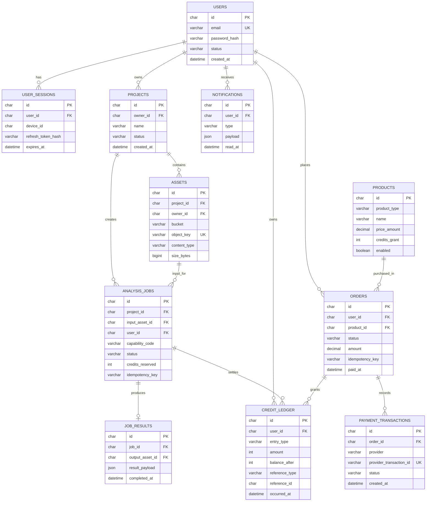

# 轻量 MVP 数据库关系图

本图只覆盖第一版需要落库的核心关系：用户、项目、素材、AI 任务、积分和支付。它不包含 MQ、Outbox、角色权限、订阅和运营配置等可后置的扩展表。

## 先实现的表

1. `users`、`user_sessions`：登录与多设备会话。
2. `projects`、`assets`：项目与 MinIO 对象元数据；文件本体不进 MySQL。
3. `analysis_jobs`、`job_results`：任务状态与结果索引；不依赖 MQ。
4. `products`、`orders`、`payment_transactions`、`credit_ledger`：积分购买、支付回调和不可变账本。
5. `notifications`：站内通知，可晚于主流程落地。

## 需要先定下来的约束

- `users.email` 唯一；邮箱统一转小写后再保存。
- `assets.object_key` 唯一；建议包含环境、用户、项目和素材 ID。
- `analysis_jobs` 与 `orders` 都使用 `(user_id, idempotency_key)` 唯一约束，防止重复创建和重复扣费。
- `payment_transactions.provider_transaction_id` 唯一，避免支付回调重复入账。
- `credit_ledger` 只插入、不更新和不删除；余额以账本计算或由快照加速读取。
